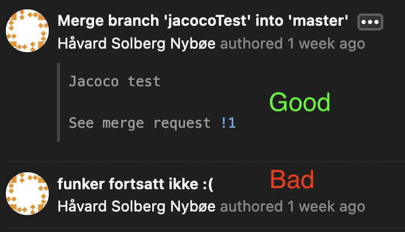

# Git Guidelines

Guidelines and standard for commits, issues, branching og merge requests.

## Commits

A commit shall:

- contain a short description of it's content
- describe what content it's related to 
- written in english 

A commit can:

- describe why the changes has been done
- refer to an issue or merge request 
- describe the content in more detail, but not its functionality 

Example on a good and a bad commit below...

## Issues

An issue shall:

- describe the task on hand
- be relevant to the project
- be tied to an milestone
- be marked with a tag

## Branching

All work shall be done on a seperate branch, "master" shall not be used. This helps retaining a working "master"-branch.

The work done on a branch shall be within the same task/area. This means that if we change tasks, we change branches. 

## Merge requests

When the work is completed, the branch is to be merged into "master". They will be compared, and merge conflicts are to be resolved. 

A merge request is set up, and another member of the team shall look at it and approve the merge request.

