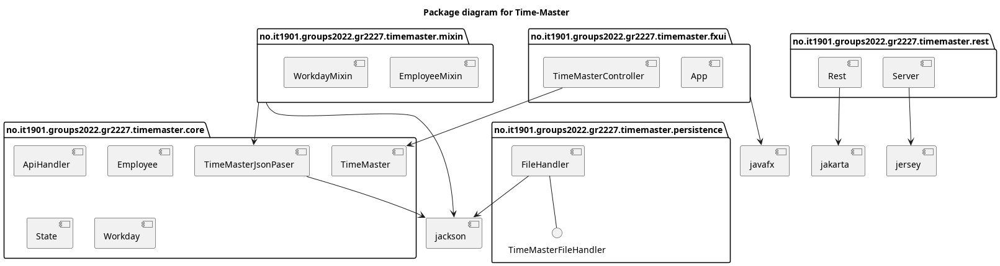
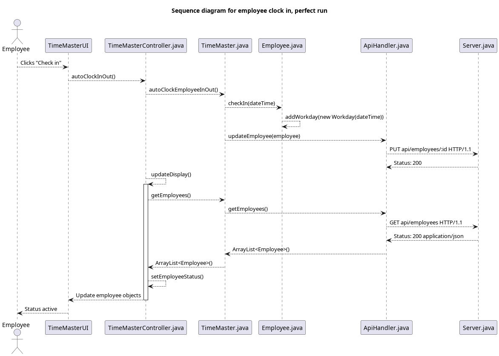

# Release 3

[TOC]

## Goals for release 3

Our goals for release 3 was to:

- Get even better at using Git as a development tool
- Learn how to implement REST API
- Increase test coverage
- Write JavaDocs
- Continously check code quality with Checkstyle and Spotbugs
- Write better user stories
- Pair program
- Make three different types of diagrams 

## Progress since release 2

We have:

- Created a REST API with Jakarta running on a Jersey server
- Moved persistence from `core` to `FileHandler.java` in a new module `persistence`
- Created a data access layer in core called `ApiHandler` which handles all connections with the REST API
- Created tests for all new classes
- Improved test coverage for existing classes
- Improved validation in GUI
  - (spesifiser mer)
- Created JavaDocs for all classes and modules
- Added functionality in application
  - Implemented workday history
  - Made it possible to delete employees
- Made three [diagrams](##Diagrams)
  - Classdiagram
  - Packagediagram
  - Sequencediagram
- Updated readmes
- Improved user stories 
- Made the application shippable with jlink and jpackage

## Reflections

We have become much more comfortable with using Git as a tool. Much of our earlier work would have been easier with the workflow we have achieved in this sprint. However, we have still encountered some "technical difficulties". For example in one merge, when trying to merge a branch that was quite a few commits behind, something went horribly wrong and all the commits that had been done since creating the branch doubled. Meaning that our project suddenly had about 100 extra commits. We figured out why it happended, and realised that the way we did merges (or some of us did merges) might not be the best way. We did try to fix it, thinking we could squash the extra commits, but after a few tries and some sketchy conflicts we decided to just leave it, and use the situation as a moment of learning. 

Based on experiences from previous sprints, have we chosen to meet more frequently in this sprint. This has made it even easier to work together and pair program, which has resulted in increased efficiency. It has also made all team members more involved in each of the tasks we have completed this sprint, and enabled everyone to take part in different aspects of the application. The pair programming has resulted in a difference between number of commits, because we have been doing a lot of work from the same computer and same user. 

This project, and especially this last sprint, has given us lots of experience that team members already has started to use in other group projects, and we will surely continue to apply and develop in future projects. 

All in all, this sprint has been less chaotic, nevertheless we still have a lot to learn. 

## User stories

We made more detailed user stories after feedback from our teaching assistant. We did this by imagining scenarios. The stories included a scenario with both possible problems and possible solutions when the app is in different states. The user stories cover: 
- the interaction between user and the app 
- adding and deleting employees
- clocking in and out, both automatic and manually
- checking and editing the hours worked

These user stories were the basis for improvements and further development of the application.  

- [User story 1](../userstories/userstory1.md)
- [User story 2](../userstories/userstory2.md)
- [User story 3](../userstories/userstory3.md)
- [User story 4](../userstories/userstory4.md)
  

## REST API

[REST API endpoints](rest-api.md)

## Git guidelines

[Git guidelines](../git-guidelines.md)

## Testing
The application has 85% test coverage without the server running, and 87% coverage with the server running.
We have tried to test most methods and scenarios in all classes, and we have actively used the tests to make sure the program still worked when merging. Our CI/CD pipeline setup has contributed to this, as we can clearly see that the program still manages to build, setup the server, pass the tests and pass coverage. 

We wanted to focus on making the UI foolproof (as much as possible) for users to use. Therefore we were especially thorough when testing the UI, checking most edgecases and validations.  

All members of the group have made tests in the different modules, and we have pair programmed alot when making the tests. We all agree that this greatly improved the quality of the tests, and how efficiency we were when making them. 

## Diagrams

### Class diagram

### Package diagram

### Sequence Diagram

