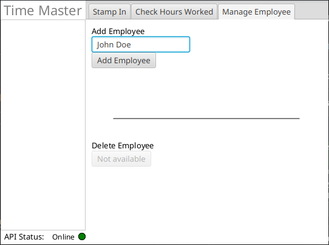
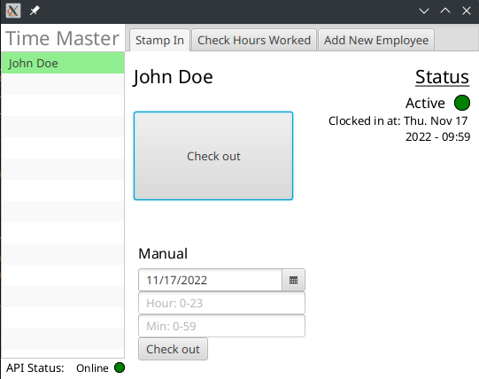
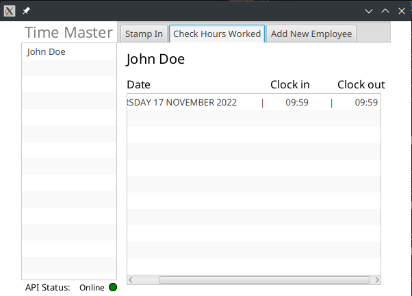

# Time Master

Time Master is an app that keeps track of the employees hours. Its purpose is to make it easier for employees to register when their shift starts and ends. It saves the information digitally, and is therefore easy to access for both employees and employer. 

Employees have the opportunity to look at their previous hours. If there is something wrong with them, the employee is able to edit them. There is also possible to add and delete employees. 

## User stories 

The user stories we have used when developing the application can be found [here](../docs/userstories/userstory1.md).

## The application

